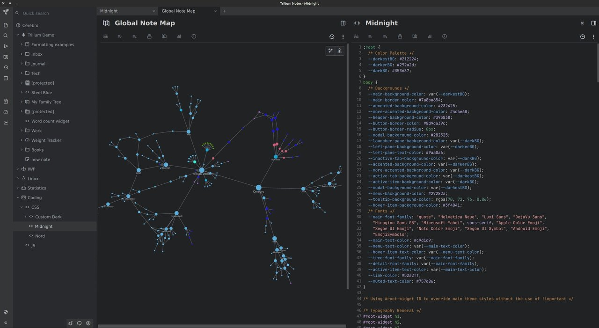

# midnight - Theme for Trilium Notes

A theme with soft, dark colors.

_The style of the theme is similar to the theme selections of many modern programs. E.g. with the standard dark themes of VSCode, or the popular One Dark theme. The creation of this theme for Trilium was mainly inspired by SiYuan's (PKM Tool) Midnight theme._

## Preivew:

_(Might be outdated)_

## Installation

- Create a new note inside your Trilium Notes and set the Note Type to `CSS`
- Copy the content of the themes `.css` file inside the Note you just created
- Add the label `#appCss`
  - You can do that in the `Owned Attributes` on the top of your note <kbd>Alt+A</kbd>
  - If are currently using other custom themes, make sure the theme you intend to use is the only one with the `#appCss` label
- Reload <kbd>Ctrl+R</kbd>

---

Disclaimer:
_I'm not a big Trillium user anymore, since I moved all my coding and knowledge management to neovim. But I will do my best to implement improvements and fixes. If I can help in any way, feel free to leave me a message._

## Other themes I adapted to work with Trilium Notes:

- EOTE: https://github.com/tobealive/eote-theme-trilum
